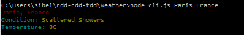

# cli-weather

## Install

```
$ npm install yql
$ npm install lodash
$ npm install meow
$ npm install chalk
$ npm install update-notifier
```
## Usage
*Launch the cli.js to obtain the Weather (of Dhaka by default)

## API

### Cli([options])

#### options

##### city

Type:  *your city*<br>
Default: `dhaka`

Select the city of the weather.

##### country

Type:  *your country*<br>
Default: `Bangladesh`

Select the country of the weather associated to the city.
# 
##### scale

Type:  *C/F*<br>
Default: `C`

Select the scale required.
##### HELP

Type: --help <br>

Pour plus d'informations.


